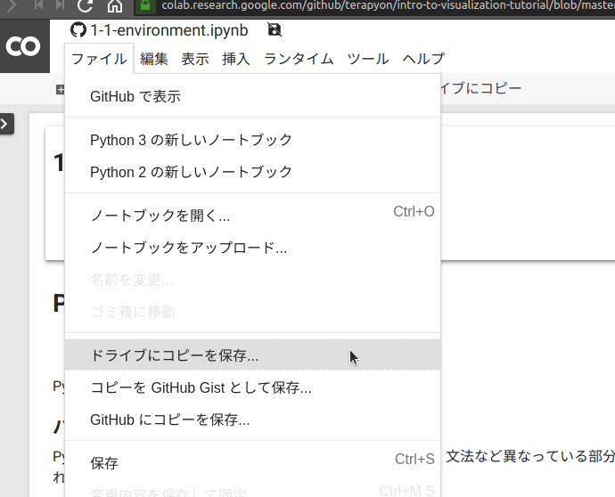
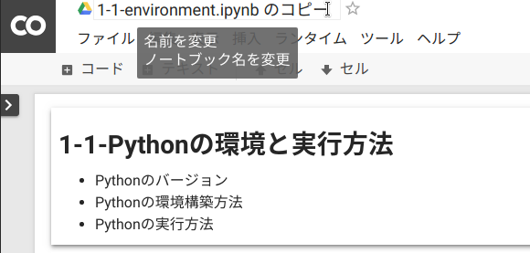

# 概要

タイトル: Intro to Visualization Tutorial at SciPy Japan

レポジトリ: https://github.com/terapyon/intro-to-visualization-tutorial

SciPy Japan 2019 にて行った、チュートリアルの内容

https://www.scipyjapan2019.scipy.org/talks-and-poster-schedule


- 3.5時間の各自パソコンを持ち込んだ実習チュートリアル
- タイトル: Pythonの基本からデータの可視化を体験
- 講師: Manabu TERADA (@terapyon) / `@driller` 
- TA: Takeshi Akutsu / Shingo Tsuji
- 概要
  - データ分析や機械学習または科学技術計算をPythonを用いて実行したいという方が増えていると思います。これらを行う時に、ExcelやR、MATLABを使っているという方も多いと思います。
  - このチュートリアルでは、Jupyter Notebookを使い可視化を行う流れを体験して頂き、Pythonで実装する流れをつかんでもらいます。
- ターゲット
  - Python初心者
  - Pythonでデータ分析や機械学習または科学技術計算をやりたい
- 説明しないこと（理解している前提とする）
  - データ分析の目的
  - 可視化とは何か
- ゴール
  - Pythonの基礎を知る
  - Pythonでデータ始められるようになる
  - Pythonで可視化の方法を知る


# チュートリアルの内容や環境

- 実行環境
  - Jupyter Notebook (Python 3.6 or Python 3.7)
- 使用するライブラリ
  - Matplotlib
  - pandas
  - NumPy
  - (SciPy ・・使うかどうか未定)
  - (Scikit-learn ・・使うかどうか未定)
- セクション
  - Pythonの基礎
  - データの扱いや各種ツールの概要
  - 実データでの可視化

# 事前準備

- ノートパソコン (Windows / macOS / Linux)
  - ChromeまたはFirefoxが動作する
  - Python 3.6 または Python 3.7 が動作する
- 環境準備
  - Python 3.6 または Python 3.7のインストール
  - Jupyter Notebookのインストール
  - Matplotlib、pandas、NumPyのインストール

なお、環境準備に不安のある方は、チュートリアル中に利用できるColaboratory(Google)を使って受講が出来るようにしますので、googleアカウント(gmailアカウントなど)を準備し、https://colab.research.google.com にて利用の開始を行ってください。


# 環境構築

```
$ git clone https://github.com/terapyon/intro-to-visualization-tutorial
$ python3 -m venv env
$ source env/bin/activate
(env) $ cd intro-to-visualization-tutorial
(env) $ pip install -r requirements.txt
(env) $ jupyter notebook
```

# Colaboratory手順

下記の  をクリックします。

章-節|タイトル|Open in Colab
-----|--------|-------------
1-1  |Pythonの環境と実行方法|[](https://colab.research.google.com/github/terapyon/intro-to-visualization-tutorial/blob/master/1-basic-python/1-1-environment.ipynb)
1-2  |データ型と関数|[](https://colab.research.google.com/github/terapyon/intro-to-visualization-tutorial/blob/master/1-basic-python/1-2-types-and-functions.ipynb)
1-3  |制御構文|[](https://colab.research.google.com/github/terapyon/intro-to-visualization-tutorial/blob/master/1-basic-python/1-3-controlflow.ipynb)
1-4  |ライブラリ|[](https://colab.research.google.com/github/terapyon/intro-to-visualization-tutorial/blob/master/1-basic-python/1-4-libraries.ipynb)
1-5  |演算子|[](https://colab.research.google.com/github/terapyon/intro-to-visualization-tutorial/blob/master/1-basic-python/1-5-operator.ipynb)
1-6  |数値の扱い|[](https://colab.research.google.com/github/terapyon/intro-to-visualization-tutorial/blob/master/1-basic-python/1-6-numbers.ipynb)
2-1  |データの取得方法|[](https://colab.research.google.com/github/terapyon/intro-to-visualization-tutorial/blob/master/2-data-handling-and-tools/2-1-getting-data.ipynb)
2-2  |データの加工|[](https://colab.research.google.com/github/terapyon/intro-to-visualization-tutorial/blob/master/2-data-handling-and-tools/2-2-data-handling.ipynb)
2-3  |データの概要を捉える|[](https://colab.research.google.com/github/terapyon/intro-to-visualization-tutorial/blob/master/2-data-handling-and-tools/2-3-summarize.ipynb)
3-1  |可視化ツール|[](https://colab.research.google.com/github/terapyon/intro-to-visualization-tutorial/blob/master/3-visualization/3-1-visualization-tools.ipynb)
3-2  |Matplotlibの基本|[](https://colab.research.google.com/github/terapyon/intro-to-visualization-tutorial/blob/master/3-visualization/3-2-Matplotlib-basic.ipynb)
3-3  |pandasによる可視化|[](https://colab.research.google.com/github/terapyon/intro-to-visualization-tutorial/blob/master/3-visualization/3-3-pandas.ipynb)
3-4  |演習|[](https://colab.research.google.com/github/terapyon/intro-to-visualization-tutorial/blob/master/3-visualization/3-4-exercise.ipynb)
3-5  |演習の解答例|[](https://colab.research.google.com/github/terapyon/intro-to-visualization-tutorial/blob/master/3-visualization/3-5-exercise-with-anser.ipynb)
3-A  |Matplotlibの日本語フォント設定|[](https://colab.research.google.com/github/terapyon/intro-to-visualization-tutorial/blob/master/3-visualization/3-A-Matplotlib_font.ipynb)
3-B  |3-B-気象庁のデータの整形|[](https://colab.research.google.com/github/terapyon/intro-to-visualization-tutorial/blob/master/3-visualization/3-B-handling-weather.ipynb)


`ファイル` - `ドライブにコピーを保存` を選択します。



Notebookの名前を適宜変更します。



# ライセンス

MIT License

